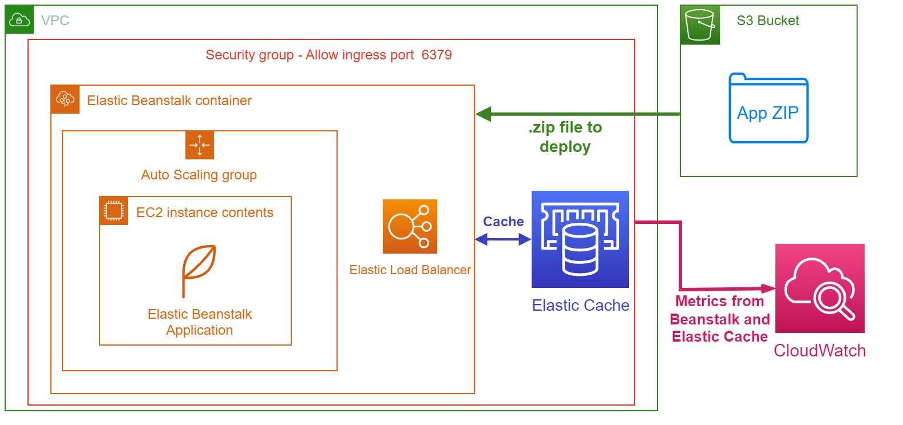

<div align = "center">

  # Cache and Beanstalk
  
  
  


  
## [Full documentation here](https://gianvr.github.io/cache-and-beanstalk-docs/)
  
## Infrastructure architecture


  
 </div>
 
## Requirements 

- [AWS CLI](https://docs.aws.amazon.com/cli/latest/userguide/install-cliv2.html) 
- [Terraform](https://learn.hashicorp.com/tutorials/terraform/install-cli)

## Commands (in `./terraform`)

1. To initialize Terraform:
```bash
terraform init
```
2. To generate the execution plan
```bash
terraform plan
```
3. To build the infrastructure
```bash
terraform apply --auto-approve
```

4. To deploy the application
```bash
aws elasticbeanstalk update-environment --application-name app-beanstalk --version-label v1 --environment-name beanstalk-environment
```

5. To destroy the infrastructure
```bash
terraform destroy --auto-approve
```
